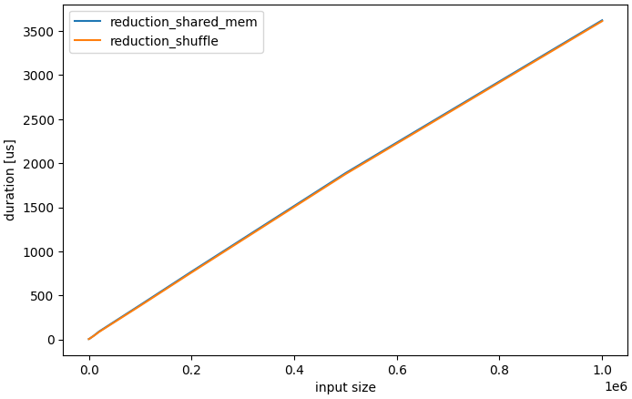
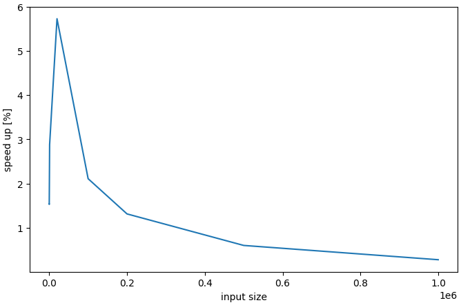
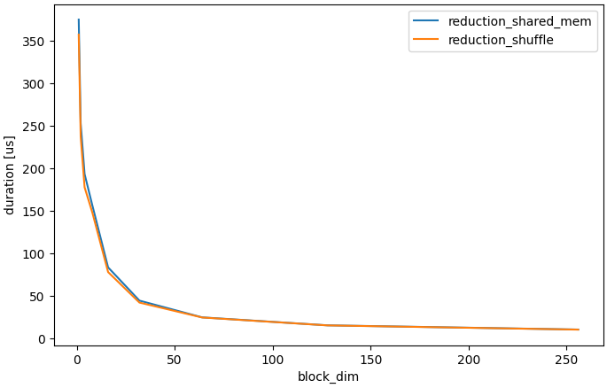
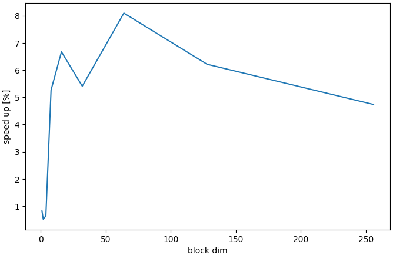

## 06-reduction
This example shows variants of reduction (addition) algorithm. 
1. `reduction_shared_mem`
I used shared memory to compute the summation. 

2. `reduction_shuffle`
I used shuffle function to compute the summation.

Note that I used this device for this example (I got this information by using an example `05-device`).
```text
Device Number: 0
  Device name: NVIDIA GeForce RTX 4090
  Memory Clock Rate (KHz):10501000
  Warp size: 32
  Max threads per block: 1024
  Max threads per multiprocessor: 1536
  Max threads per block dimension: (1024, 1024, 64)
  Max grid size: (2147483647, 65535, 65535)
  Total global memory (bytes): 25351290880
  Shared memory per block (bytes): 49152
  Memory bus width (bits): 384
  Compute capability: 8.9
```

### Experiment
#### input size
Execution time was measured with varied `input_size` for each method. Note that `grid_dim = {1, 1, 1}`, `block_dim = {32, 1, 1}` was used.
Here is the duration for each method. As expected, the input size is bigger, the execution time getting bigger.

Also visualized the speed up from `reduction_shared_mem` to `reduction_shuffle`.

Using the shuffle method is generally efficient, but its effectiveness tends to decrease as the input size increases.

#### block dim
Execution time was measured with varied `block_dim` for each method. Note that `input_size` is fixed to `10,000`.
Here is the duration for each method. The larger the block dimension used, the faster the speed.

Also visualized the speed up from `reduction_shared_mem` to `reduction_shuffle`.
